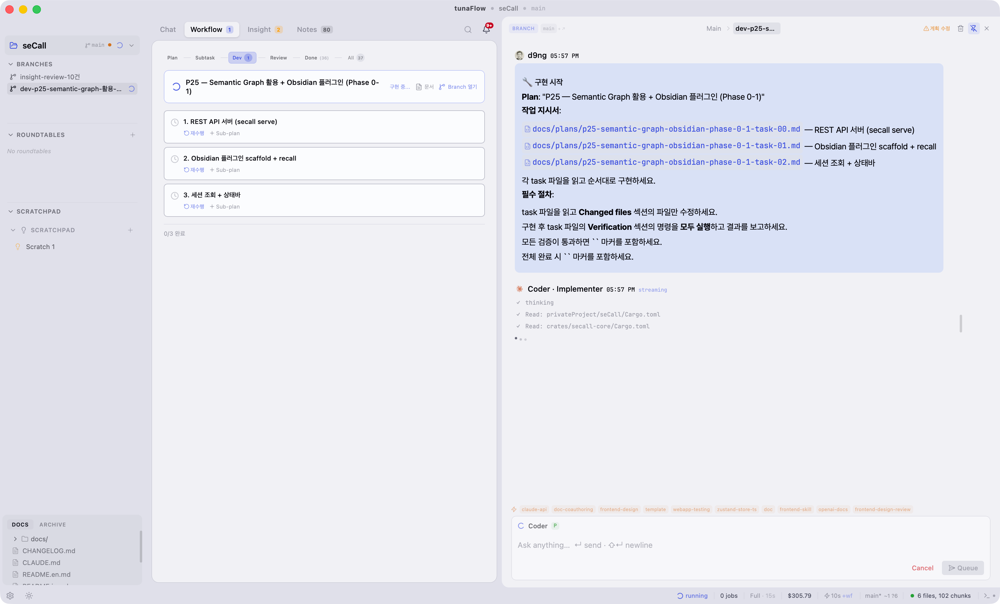

<div align="center">

# tunaFlow

**AI Agent Orchestration Client**

[](https://v2.tauri.app/)
[](https://react.dev/)
[](https://www.rust-lang.org/)
[](.)
[](.)
[](.)

[](./README.md)
[](./README.en.md)

> **Of the agent, By the agent, For the agent**

*도메인 전문가가 AI 에이전트를 팀처럼 운영하기 위한 데스크톱 클라이언트*

</div>



---

## 이런 분께 맞습니다

- Claude Code / Codex / Gemini를 쓰는데 **단순 채팅이 아닌 체계적인 작업 흐름**이 필요한 분
- 에이전트에게 일을 시키되 **내가 방향과 판단은 유지**하고 싶은 분
- 혼자 또는 소규모로 AI 에이전트를 **실질적인 개발 워크플로우에 통합**하려는 분

---

## 시작점

세 글에서 출발했습니다:
[Stavros Korokithakis — Building with Claude Code](https://www.stavros.io/posts/building-with-claude-code/) · [Sebastian Raschka — Components of a Coding Agent](https://magazine.sebastianraschka.com/p/components-of-a-coding-agent) · [Addy Osmani — Orchestrating Coding Agents](https://addyosmani.com/blog/code-agent-orchestra/)

---

## 핵심 문제와 tunaFlow의 답

멀티 에이전트를 쓰다 보면 세 가지 문제가 반복됩니다.

| 문제 | tunaFlow의 구조적 해결 |
|------|----------------------|
| **맥락 붕괴** — 위임할수록 원래 의도가 흐릿해짐 | **ContextPack**: 매 요청마다 Plan + 메모리 + 역할을 재조립해서 전달 |
| **유령 위임** — 에이전트가 완료라고 했지만 인계 실패 | **Doom loop 감지**: 3회 실패 시 자동 에스컬레이션 → Architect 재설계 |
| **자기 검증** — 자기가 쓴 코드를 자기가 리뷰 | **역할 분리**: Developer ≠ Reviewer, RT 2-agent 교차 검증 |

---

## 주요 기능

### 오케스트레이션 워크플로우

```
Chat → Plan 설계 → 승인
  → Developer 자동 구현 (PTY 또는 -p 모드)
  → Reviewer 2-agent 교차 검증
  → Pass / Rework / 재설계 루프
```

Architect → Developer → Reviewer 3-role 시스템. Plan이 실패하면 findings를 분석해서 rev.N+1을 자동으로 제안합니다.

### PTY Terminal

`-p` 플래그의 제약 없이 Claude Code와 완전한 인터랙티브 세션. 파일 읽기/수정/명령 실행 등 full tool use가 가능합니다.

### Roundtable (RT)

여러 엔진의 에이전트가 하나의 주제로 토론. Sequential(순차) 또는 Deliberative(동시) 모드. 모든 RT는 Branch의 확장입니다.

### ContextPack

4개 엔진 공통 프롬프트 조립. Lite/Standard/Full 자동 Tiering으로 RT에서 ~70% 토큰 절감. rawq 코드 검색, 장기기억, 실패 학습, 역할 문서를 맥락에 자동 포함합니다.

### Insight

rawq + code-review-graph가 사전에 추출한 데이터만 에이전트에게 분석시킵니다 (50k~200k 토큰 → 5k~20k). 안정성/테스트/아키텍처/성능/보안/기술부채 6개 카테고리, Quick Wins 자동 수정.

### 지원 엔진

| 엔진 | 연동 |
|------|------|
| Claude (Anthropic) | CLI subprocess |
| Codex (OpenAI) | CLI subprocess |
| Gemini (Google) | CLI subprocess |
| OpenCode | CLI subprocess |
| Ollama / LM Studio / vLLM | HTTP SSE |

---

## 시작하기

### 사전 준비

- macOS (현재 macOS only)
- Node.js 20+, Rust stable
- 아래 에이전트 CLI 중 **1개 이상**:
  ```bash
  npm install -g @anthropic-ai/claude-code   # Claude
  npm install -g @openai/codex               # Codex
  npm install -g @google/gemini-cli          # Gemini
  ```

### 개발 실행

```bash
git clone https://github.com/hang-in/tunaFlow.git
cd tunaFlow
npm install
npm run tauri dev
```

### 빌드

```bash
npm run tauri build
```

> **베타 배포** 준비 중입니다. 릴리즈 설치 방법은 [betaReleaseReadinessPlan](./docs/plans/betaReleaseReadinessPlan.md)을 참고하세요.

---

## 기술 스택

Tauri 2 + React 18 + TypeScript + Zustand 5 + Tailwind CSS 4 + Rust + SQLite (WAL, v30)

코드 검색: rawq sidecar (bge-m3 임베딩), code-review-graph, context-hub
외부 연동: HTTP API (16 endpoints) + WebSocket, MCP 서버 (`tunaflow-mcp`)

---

## 문서

| 문서 | 내용 |
|------|------|
| [CLAUDE.md](./CLAUDE.md) | 아키텍처, 컨벤션, 세션 핸드오프 (Claude Code용) |
| [Architecture Detail](./docs/reference/architecture-detail.md) | RT 흐름, Store 구조, DB 스키마, 이벤트 모델 |
| [Implementation Status](./docs/reference/implementationStatus.md) | 기능별 구현 현황 |
| [Beta Release Plan](./docs/plans/betaReleaseReadinessPlan.md) | 배포 준비 체크리스트 |
| [CI/CD Plan](./docs/plans/cicdReleasePlan.md) | GitHub Actions 빌드/릴리즈 설계 |
| [Papers](./docs/reference/papers.md) | 설계 참고 논문 |
| [Dev History](./docs/reference/devHistory.md) | 프로젝트 계보 + 세션별 개발 이력 |

---

## 연락처

- Email: d9ng@outlook.com

---

*Private project. 100% AI-authored codebase — Claude Code가 작성, 사람은 방향만 결정합니다.*
